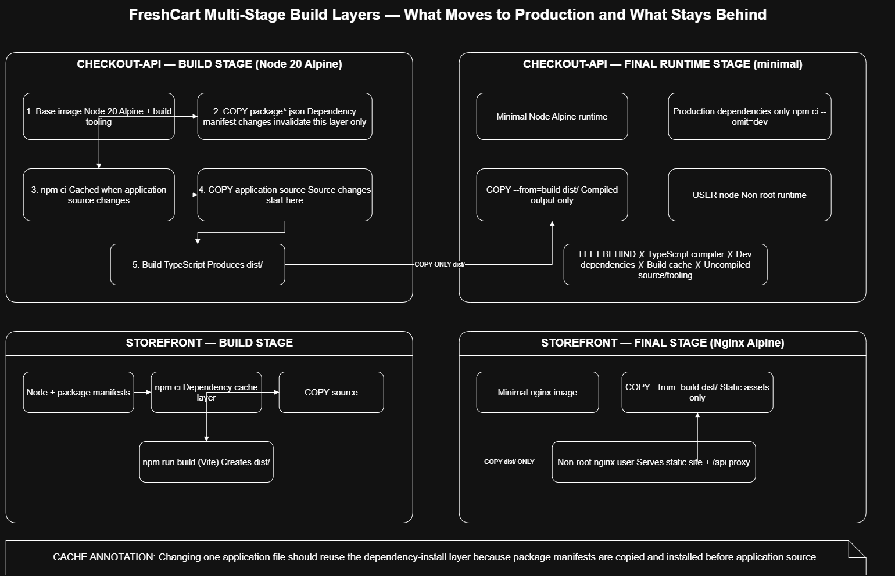
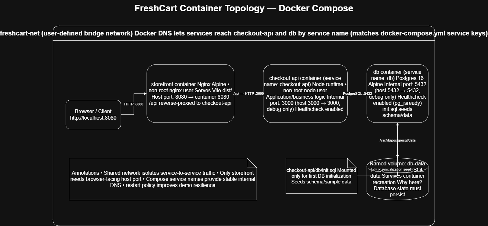

# FreshCart

FreshCart is a small grocery-delivery app: an Express + TypeScript API backed by Postgres, and a static Vite frontend that calls it. This repo is the Week 4 Capstone submission — containerizing both services and running them together with Postgres via Docker Compose.

## Week 4 Capstone — Containerize, Compose, and Ship

**Registry image:** [`jefftheson/freshcart-checkout-api`](https://hub.docker.com/r/jefftheson/freshcart-checkout-api) — versioned tags `1.0.0` → `1.0.2` (see scan history below)

**Blog post:** [link once published] — *"Containerizing a Real App: What I Learned About Layers, Secrets, and Not Running as Root"*

**Diagrams:**





Editable source: [`docs/layer-diagram.drawio`](./docs/layer-diagram.drawio) · [`docs/topology-diagram.drawio`](./docs/topology-diagram.drawio) — open in [app.diagrams.net](https://app.diagrams.net)

**Design write-up:** [`docs/DESIGN.md`](./docs/DESIGN.md) — one paragraph per major decision (base image, layer order, non-root, volume placement, scan findings)

### What's in here

- `checkout-api/Dockerfile` — multi-stage build: `node:20-alpine` build stage → `node:20-alpine` runtime, deps installed before source so code edits don't bust the dependency-install cache, runs as the built-in non-root `node` user
- `storefront/Dockerfile` + `storefront/nginx.conf` — Vite build stage → `nginx:1.27-alpine` runtime, rewritten to run non-root on port 8080, reverse-proxies `/api/*` to `checkout-api` on the internal network
- `docker-compose.yml` — `storefront`, `checkout-api`, and `db` (Postgres) on a shared bridge network, Postgres data in a named volume, seeded once from `checkout-api/db/init.sql`

### Vulnerability scan: before → after

Scanned with Docker Scout. Removing the npm CLI and its bundled internal tooling (`tar`, `minimatch`, `glob`, `pacote`, `sigstore`, `cross-spawn`, `brace-expansion`) from `checkout-api`'s final stage — since the container only ever runs `node dist/index.js`, never `npm` — cut the count roughly in half:

| | `1.0.0` (before) | `1.0.2` (after) |
|---|---|---|
| Total vulnerabilities | 57 | 28 |
| Affected packages | 14 | 3 |
| Critical | 4 | 3 |
| High | 34 | 15 |
| Medium | 14 | 8 |
| Low | 5 | 2 |

Remaining findings are in `openssl`, part of the Alpine base OS layer rather than anything in `package.json` — see `docs/DESIGN.md` for the full reasoning on why that's an accepted risk for this project rather than something patched by hand.

### Running it

```bash
docker compose build
docker compose up -d
docker compose ps

curl http://localhost:3000/healthz
curl http://localhost:3000/api/products
```
Then open `http://localhost:8080` for the storefront.

---

## About the app itself

FreshCart is a small grocery-delivery app you'll build on throughout this program. It's not a finished product — it's the same working codebase you'll containerize, provision infrastructure for, ship through a pipeline, orchestrate, and monitor as the course goes on. Same app, every week, so the work compounds instead of starting over each time.

## What's actually here

Two services and a database:

- **`checkout-api/`** — an Express + TypeScript API backed by Postgres. Lists products, handles search, and places orders.
- **`storefront/`** — a static site (Vite + TypeScript, no framework) that calls the checkout API. Builds to plain HTML/CSS/JS.
- **Postgres** — provisioned via `docker-compose.yml` in this repo (see above).

## Running it locally, without Docker

You'll need a Postgres database reachable from your machine, and Node.js 20+.

**checkout-api**
```
cd checkout-api
cp .env.example .env      # edit DATABASE_URL to point at your Postgres
npm install
npm run dev                # tsx watch, restarts on save
```
Load `db/init.sql` into your database once, however you'd normally run a `.sql` file against Postgres — it creates the schema and seeds about 15 products.

Once it's running: `curl localhost:3000/healthz` should return `{"status":"ok"}`, and `curl localhost:3000/api/products` should return the seeded list.

**storefront**
```
cd storefront
npm install
npm run dev
```
Vite's dev server proxies `/api` to `localhost:3000` automatically (see `vite.config.ts`) — open the URL it prints, and you should see a product grid you can actually buy from.

## API reference

| Method | Path | Does |
|---|---|---|
| GET | `/healthz` | Checks the API can reach the database. |
| GET | `/api/products` | Lists all products. Add `?search=term` to filter by name. |
| GET | `/api/products/:id` | One product. |
| POST | `/api/orders` | `{ customerName, customerEmail, items: [{ productId, quantity }] }`. Validates stock, records the order transactionally. |
| GET | `/api/orders/:id` | An order and its line items. |

## Environment variables

**checkout-api** (`.env.example`): `DATABASE_URL`, `PORT`.
**storefront** (`.env.example`): `VITE_API_BASE_URL` — leave unset for local dev (the Vite proxy handles it) and unset for the Docker build too (nginx's reverse proxy handles it instead — see `storefront/nginx.conf`).

